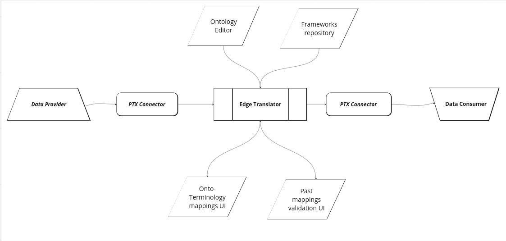
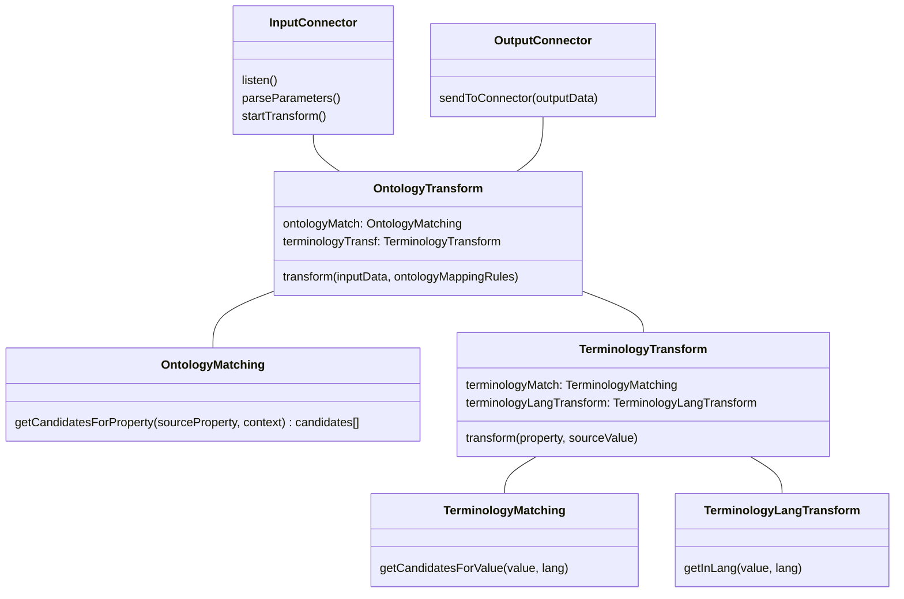
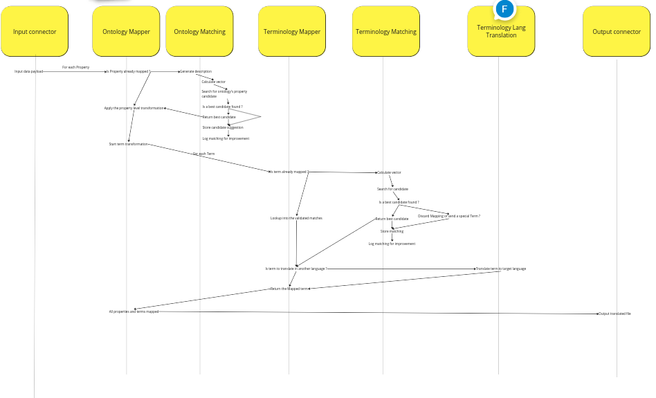
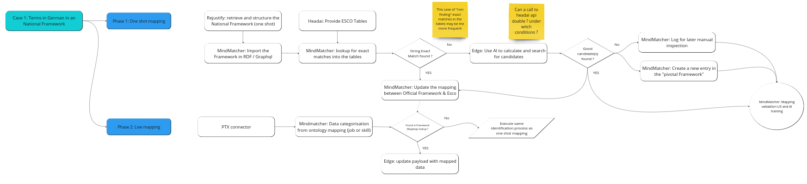

[TOC]

# ‘‘EDGE AI Translator BB’’ Design Document 

The baseline of this building block is: “On Institutional Edges for AI Assisted Onto-Terminology Translators.”. 

The **AI Translator** is a tool to help us achieve **Frictionless Interoperability. **

In the data world, like in the spoken language world, translation require 2 abilities : 

* 1/ Ability to understand the “content” (or values) in the data. In language it’s called vocabulary, we call it **Terminology**.
* 2/ Ability to understand the “structure” (or data-model). In language it’s called grammar, we call it **Ontology**.

To explain the spirit of this Building Block we will divide it into 3 sections : 

* **Onto-Terminology Translators: ** computer services that translate the structure & the content of a data input to another format. This is the digital twin of a human that translates a text from one language to another. 
* **AI Assisted:** full translation of data is a tough thing, and even if AI can make good automatic results, humans will always be here to control and fix some things. We will develop a concept of “Semantic Suggestions” to help communication between humans and translators. 
* **On Institutional Edge:** our long term vision is that Translators should be installable to any institutional edge infrastructure to ensure full compliance and possibility. 

As a central part of the “common language”, the Ontology Editor will provide a community sourced and updated pivotal onto-terminology for all partners of the project.

## Technical usage scenarios & Features

The Edge Translator is the core component for the process of translating input data format and value to a standard output one. 

This component will work in conjunction with others in order to provide best translations. These side-car components are the following 4 : 

* **The Ontology Editor** helps the community to define and share a common data-model for data exchanges. It helps any actor with documentation and API to understand and manipulate the RDFS data-model.
* **The Frameworks Repository** contains not only all the usual frameworks of the community but also the specifics ones. It provides anyone with the access to the  shared and dereferencable terms definition.
* **The Onto-Terminology Mapping UI** is an application that allows data-provider to validate the mapping suggestions done by the AI or to create new ones.
* **The Past Mappings validation UI** is an application that allows to view and validate the mappings done by the AI and then provide feedback for continuous training and improvement of the AI.

With the environment of PTX, the Edge Translator environment can be schematised as: 

The rest of this document will focus on the Edge Translator component.

### Features/main functionalities

* Includes PTX Connectors for data exchange
* Translates data between different json input data to pivotal ontology and terminology
* Provides an Edge Translator for data transformation
* Complies with W3C, European, and HRopen standards. Provides Json-ld as output 
* Exports and shares controlled and interoperable data  
* Is integrated with the Frameworks Repository for shared and dereferencable terms definition
* Is integrated with the Onto-Terminology UI for data mapping validation
* Is integrated with the Past Mappings validation UI for AI training and improvement

### Technical usage scenarios

* Translation of data for interoperability between different systems and applications
* Facilitation of data exchange within the community by providing a common data model
* Provision of documentation and APIs for understanding and manipulating RDFS data models
* Allow data-consumer to implement one data-model integration and be able to connect to multiple data-sources.
* Allow data-consumer to ask for a language translation of value into a target language (it will focus on French, German and English for now)

## Requirements

* Translator MUST transform skills & jobs related data in json to json-ld 
* Translator MUST log the mappings done 
* Translator MUST provide configuration option to select the output terminology & language, the activation of complementary services
* Translator MUST interface with Dataspace Connector
* Translator SHOULD collect concepts that come from specific (not shared) terminologies
* Translator MUST 
* Translator SHOULD be able to to connect to external stock data to transform
* Translator SHOULD
* Translator SHOULD

## Integrations

See [01_BB Connections](https://docs.google.com/spreadsheets/d/1iNFLRofdwmrgNZ7E2JPSW0PL8xIUU4EVqIt-sMo9nlk/edit#gid=0) spreadsheet

### Direct Integrations with Other BBs

BB 9b LOMCT & BB 7 Distributed data visualisation may have direct connection to the connector. 

### Integrations via Connector

Integrations with connectors may be done in the use-case of IMC, GEN or Schülerkarriere.

### Integration into the Connector Flow 

The translation service has a specific position into the actual flow of the Connector. The Translation service acts in the middle of an exchange between a data-provider and a data-consumer. 

In order to take into account this specific situation an evolution of the Contract component has to be done.

## Relevant Standards

### Data Format Standards

* Json (as input format)
* [Json-ld](https://json-ld.org/) (as output format)
* [RDF](https://en.wikipedia.org/wiki/RDF_Schema) (to describe data)
* [RDFS](https://en.wikipedia.org/wiki/Resource_Description_Framework) (for defining ontologies)
* Well known ontologies (like [skos](https://en.wikipedia.org/wiki/Simple_Knowledge_Organization_System), [schema.org](schema.org), ESCO,...)

### Mapping to Data Space Reference Architecture Models

### Input / Output Data

## Architecture

At a high descriptive level of the internals of Edge Translator we can identify this components: 

These components then use the API and data provided by Headai & Rejustify to provide their features.

The detailed séquence diagram for theses components is : 

## Dynamic Behaviour

The following diagrams show 2 concrêtes examples for the Terminology (or Framework) transformation process. 

The first case details the process when a national framework is available and can be mapped before the connection of the data-source. 

The second case details the process when an internal, not broadly available framework is used to describe the source data. The mappings are then done lively and are available for later inspection 

## Configuration and deployment settings

## Third Party Components & Licenses

## Implementation Details

## OpenAPI Specification

__In the future: link your OpenAPI spec here.__

## Test specification

### Test plan

### Unit tests

### Integration tests

### UI test (where relevant)
