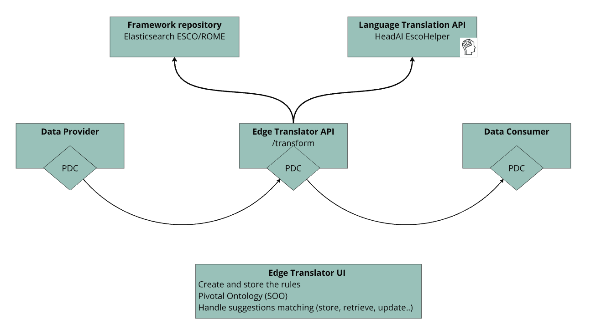
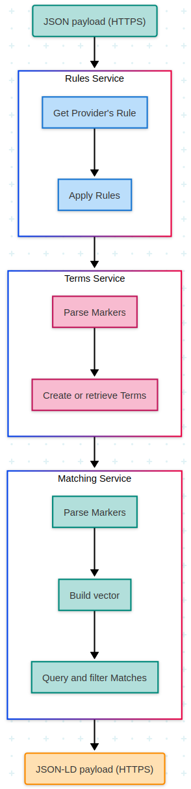
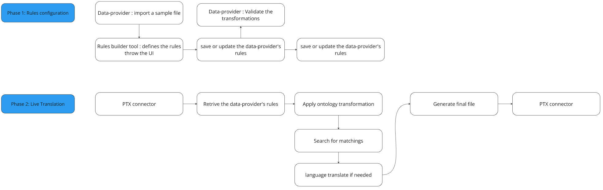

# Edge translators BB – Design Document

<!-- TOC start (generated with https://github.com/derlin/bitdowntoc) -->

- [Edge translators BB – Design Document](#edge-translators-bb--design-document)
   * [Technical usage scenarios & Features](#technical-usage-scenarios--features)
      + [Features/main functionalities](#featuresmain-functionalities)
      + [Technical usage scenarios](#technical-usage-scenarios)
   * [Requirements](#requirements)
   * [Integrations](#integrations)
      + [Direct Integrations with Other BBs](#direct-integrations-with-other-bbs)
      + [Integrations via Connector](#integrations-via-connector)
      + [Integration into the Connector Flow ](#integration-into-the-connector-flow)
   * [Relevant Standards](#relevant-standards)
      + [Data Format Standards](#data-format-standards)
      + [Mapping to Data Space Reference Architecture Models](#mapping-to-data-space-reference-architecture-models)
      + [Input / Output Data](#input--output-data)
   * [Architecture](#architecture)
   * [Dynamic Behaviour](#dynamic-behaviour)
   * [Configuration and deployment settings](#configuration-and-deployment-settings)
   * [Third Party Components & Licenses](#third-party-components--licenses)
   * [OpenAPI Specification](#openapi-specification)
   * [Test specification](#test-specification)
      + [Test plan](#test-plan)
      + [Unit tests](#unit-tests)
      + [Integration tests](#integration-tests)
   * [Partners & roles](#partners--roles)
   * [Usage in the dataspace](#usage-in-the-dataspace)

<!-- TOC end -->

The **EDGE AI Translator** is a tool to help us achieve **Frictionless Data Interoperability in data transactions.** 

In the data world, like in the spoken language, translation requires 2 abilities : 

* 1\. Ability to understand the “content” (or values) in the data.   
  In language it’s called vocabulary, we call it **Terminology**.  
* 2\. Ability to understand the “structure” (or data-model).   
  In language it’s called grammar, we call it **Ontology**.

The mixture of these 2 abilities is called **Onto-Terminology**, as the capacity to translate the structure (ontology) and the content (terminology) of a data input.

To explain the spirit of this Building Block we will divide it into 2 sections : 

* **Onto-Terminology Translator:**  computer services that translate the structure & the content of a data input to another format output. This is the digital twin of a human that translates a text from one language to another.   
* **AI Assisted:** a newly developed concept of “Semantic Suggestions” by MindMatcher to help communication between humans and translators pass smoothly. Full translation of data is a tough task, and even if AI can deliver good automatic results, humans will always be here to control and fix if necessary.

As a central part of the “common language”, we provide a community sourced and updated pivotal onto-terminology for all partners of the project.

## Technical usage scenarios & Features

The Edge Translator is the core component for the process of translating input data model and value to a standard output.   
This component will work in conjunction with others in order to provide best translations. These side-car components are the following 5 : 

* **The Pivotal Ontology** helps the community to share a common data-model for data exchanges. It helps any actor with documentation and API to understand and manipulate the RDFS data-model.  
* **The Frameworks Repository** contains the common frameworks (ESCO, ROME,...) for terms (Jobs, Skills,...).  
* **The AI Translator UI** is the user interface that allows data-providers to :  
  * initiate the mapping (Rules) of their data to the Pivotal Ontology  
  * translate your data  
  * view and validate matchings done by the AI (*semantic suggestions from the selected target framework like ESCO, ROME,..)* and then provide feedback for continuous training and improvement of the AI.  
* **The AI Translator API** is the API that allows data-providers same functionalities as the UI, but the API act in a Chain:   
  * initiate the mapping (Rules) of their data to the Pivotal Ontology  
  * translate your data  
  * view and validate matchings done by the AI (semantic suggestions from the selected target framework like ESCO, ROME,..) and then provide feedback for continuous training and improvement of the AI.  
* **The Language Translation (EscoHelper)** is a component provided by HeadAI for language translation.
  
Within the PTX environment the Edge AI Translator can be schematised as: 

The simplest  use-case for this Building Bloc is as follows: 

- Company\_1 works with English ESCO and wants to hire some French employees    
- French employee\_1 completes an online Skills Test. Using PTX, Company\_1 can retrieve the Test’s results.   
- But these Test results are based on an internal framework with French terms unrelated to ESCO.  
- For instance, the Test results include an in-house skill like “Intégration au groupe.”  
- The Translator BB will search for semantically similar Skills within ESCO, rank them, and return the results.  
- In the end, Company\_1 receives a well-formatted JSON-LD  file  including  ESCO skills: its id (*esco:fcc0a1c8-d36e-4f8e-b928-00d5bca10a47*) and its label in English (*develop design ideas as a group*)

**Schuelerkarriere Use Case: Mapping to ESCO via Edge AI Translator**

To illustrate the practical application of the Edge AI Translator, we present a real-world use case involving Schuelerkarriere, a German organization facilitating initial employment opportunities for school pupils within local companies. These entry-level positions typically do not necessitate extensive experience or specific educational backgrounds.

Over its operational history, Schuelerkarriere has compiled a comprehensive inventory of frequently filled student roles, categorized into 18 distinct job families (referred to internally as "job branches"). This framework encompasses approximately 1200 individual positions. By leveraging the Edge AI Translator, Schuelerkarriere aims to map its established reference framework to the European Skills, Competences, Qualifications and Occupations (ESCO) taxonomy.

* **Data Ingestion:** Schuelerkarriere uploads its proprietary data, structured in JSON format, into the Edge AI Translator platform.  
* **Rule Definition:** The organization defines transformation rules within the Edge AI Translator to govern the data mapping process.  
* **Target Language Selection:** Schuelerkarriere selects a desired European language for the output data.  
* **Automated Translation and Mapping:** With a single action, the entire dataset is translated and mapped to ESCO, designated as the target reference framework.  
* **Human Validation:** Utilizing the user interface provided by MindMatcher, Schuelerkarriere personnel can manually review and validate the system-generated mapping suggestions.  
* **Output Generation:** The final output data is provided in the selected target language and reference framework (ESCO), enhanced with relevant skills and more detailed descriptions.

The rest of this document will focus on the Edge AI Translator component.

### Features/main functionalities

* Includes Prometheus-X Data Connector (PDC) for data exchange  
* Translates data from different json input data to a standard interoperable ontology and terminology  
* Complies with W3C, European, and HRopen standards.   
* Provides JSON-LD as output   
* Language translation handling in case of ESCO as target reference framework (HeadAI EscoHelper)  
* Is integrated with the Frameworks Repository to provide accessible terms definition to data-consumer  
* Helps you to create your Translator rules  
* Allows you to view reference framework matchings done by the AI as semantic suggestions  
* Allows to validate the AI suggestions, to set the matches you prefer, suggested by an AI, when the same input data object is processed again

### Technical usage scenarios

* Translation of data to ensure interoperability between different systems and applications
* Facilitation of data exchange within the community by providing a common data model
* Provision of documentation and APIs for understanding and manipulating RDFS data models
* Allows data-consumer to implement one data-model integration and be able to connect to multiple data-sources.
* Allows data-consumer to ask for a language translation of value into a target language (French, German, English, Spanish and Finnish are the first configured languages, any other European one can be added on request)

## Requirements

* Translator MUST translate input data structure to the pivotal one  
* Translator MUST transform skills & jobs related data in JSON to JSON-LD
* Translator MUST log the matchings done   
* Translator MUST provide configuration option to select the output terminology & language  
* Translator MUST interact with PDC  
* Translator SHOULD collect concepts that come from specific (not shared) terminologies

## Integrations

See [01_BB Connections](https://docs.google.com/spreadsheets/d/1iNFLRofdwmrgNZ7E2JPSW0PL8xIUU4EVqIt-sMo9nlk/edit#gid=0) spreadsheet

### Direct Integrations with Other BBs

BB 9b LOMCT & BB 7 Distributed data visualization may have direct connection to the PDC. 

### Integrations into the PDC Flow

The EDGE AI Translator as an Infrastructure Service that has a specific position inside Service Chains. It acts as an intermediary for an exchange between a data-provider and a data-consumer. 

## Relevant Standards

### Data Format Standards

* JSON (as input format)  
* [JSON-LD](https://json-ld.org/) (as output format)  
* [RDF](https://en.wikipedia.org/wiki/RDF_Schema) (to describe data)  
* [RDFS](https://en.wikipedia.org/wiki/Resource_Description_Framework) (for defining ontologies)  
* Well known ontologies (like [skos](https://en.wikipedia.org/wiki/Simple_Knowledge_Organization_System), [schema.org](http://schema.org),...)  
* Well known terminologies (ROME, ESCO,...)

### Mapping to Data Space Reference Architecture Models

* DSSC : [Data Model](https://dssc.eu/space/BVE/357075098/Data+Models) and partly [Data Exchange](https://dssc.eu/space/BVE/357075193/Data+Exchange)
* IDS RAM : [3.2 Functional Layer](https://docs.internationaldataspaces.org/ids-knowledgebase/v/ids-ram-4/layers-of-the-reference-architecture-model/3-layers-of-the-reference-architecture-model/3_2_functionallayer) and more precisely 3/ Ecosystem of Data and 4/ Standardised interoperability

### Input / Output Data

There are 3 categories of inputs for this building block: 

* **The data provider input**. This input should be JSON. This input data can be of any structure. Only one restriction applies on the keys of the JSON. These keys have to be “real keys” and not “data as key”. This means that JSON structure, where keys are used to provide dynamic data, can’t be parsed;   
* **The Translator Rules***.* The AI Translator UI will help you to  generate your Rules.  
* **The terms values and associated matchings from the Framework Repository**. This data will be structured by the Skos and the Matching Ontologies as JSON-LD compliant format. 

As output, 2 main categories of data will be produced: 

* **The Translator output***.* Provided to the data-consumer, this JSON-LD response will be structured as the Pivotal Ontology and will contain semantic data.  
* **The Matching suggestions**: in order to act as a logging system and be able to improve the AI & algorithm iteratively, the translator will store the matching suggestion into a standard format. These suggestions can then be reviewed and validated by humans or replayed to validate improvement of the translator’s transformations.

## Architecture

At a high descriptive level of the internals of Edge Translator we can identify these components: 

These components then use the API and data provided by Headai & Rejustify to provide their features.

## Dynamic Behaviour

The following diagram shows the 2 main behaviours of the Edge Translator: 
1/ the Rules Configuration behaviour 
2/ the Live Transformation behaviour

## Configuration and deployment settings
**Deployment:** The deployment of the translator is done through docker containers. Even if the translator works on CPU, it’s better for deployment to have GPU available.   
As dependencies, ElasticSearch & PostgreSQL have to be deployed independently (on premise or on Cloud deployment available).   
Translator’s companion apps can be deployed to any infrastructure through docker containers. 

**Logging and Operations:** The Translator log operations, errors, and warnings to standard output and / or a Cloud Logging System. Logging includes details such as incoming & output requests, calls to main components, calls to external api, ontology and terminology transformation traces. Error scenarios, such as failed input request, error during structure or value transformation, failed queries to dependent components, …. are logged with appropriate error codes and descriptions to aid in troubleshooting and debugging.

## Third Party Components & Licenses

The main Third Parties in use are: 

* Elasticsearch : licenced as [Elastic License v2 & SSPL](https://github.com/elastic/elasticsearch/tree/main/licenses)  
* PostgreSQL : [licenced](https://www.postgresql.org/about/licence/) as [The PostgreSQL License](https://opensource.org/license/postgresql)  
* Esco : licenced as [Commission Decision of 12 December 2011](https://esco.ec.europa.eu/en/use-esco/download) on the reuse of Commission documents (2011/833/EU)  
* Rome: licenced under an [Open Data Licence](https://www.francetravail.org/files/live/sites/peorg/files/documents/Statistiques-et-analyses/Open-data/ROME/rome_licence_ouverte.pdf)   
* Ariane related modules : licenced under MIT  
* FastAPI : [The MIT License (MIT)](https://github.com/fastapi/fastapi/blob/master/LICENSE)   
* Streamlit: [The Streamlit library is open sourced under the Apache 2.0 license](https://github.com/streamlit/streamlit/blob/develop/LICENSE) 

See [detailed documentation here](https://docs.google.com/spreadsheets/d/13Lf4PfVnA_lAk-7dMeIy0QRxHnarxMcsS8EaLjyOlBA/edit#gid=2045658592).

## OpenAPI Specification
* [API specification version 1.0.0](https://github.com/Prometheus-X-association/edge-translators/tree/main/docs/spec-openapi.json)

## Test specification
### Test plan
See [specific document](https://github.com/Prometheus-X-association/edge-translators/blob/main/docs/TESTS.md) on test plan.  

The main tests scenarios cover: 
- CRUD users (data providers)  
- CRUD translator rules  
- Translated outputs  
- CRUD on matchings

## Partners & roles
MindMatcher : 
* BB leader
* Organize workshops, monitor partner progress
* Develop main features of the BB, connect BB to Dataspace, setup infrastructure
* Engage in the use cases.

Headai : 
* Participate in Technical Design  
* Provide Mapping Tables structured for optimal multi-language translation.  
* Develop algorithms to facilitate the use of the translation files and develop connection to their proprietary API  
* Automate Translation processes for Official ESCO concepts.  
* Provide the [ESCO Helper](https://github.com/Prometheus-X-association/edge-translators/tree/main/esco-helper)

*Description of ESCO Helper:*
ESCO Helper is an independent implementation designed to simplify translation operations within the ESCO Ontology. It supports the following operations:
1. Retrieve the Official ESCO label (Preferred Label) of a concept based on its URI.  
2. Translate ESCO labels into various languages.   
3. Match a given label syntactically with an official ESCO Label. This involves calculating the syntactic distance between the provided label and all ESCO labels (preferred and altered labels). A maximum syntactic distance of 2 or 3 is recommended for better flexibility, accommodating small typos or plural/singular mismatches.   
4. Semantically match a given label that may not be present in the Official ESCO Label, but may be a synonym of one that is official. This is achieved with an expansion of the translation tables that is performed during their generation. Using different Language Models, each preferred and alternative label in ESCO is expanded with several synonyms, which are identified as such in the translation files.   
5. Syntactic and Semantic Matching can be disabled. In that case, all provided labels during the translation process must exactly match Official ESCO labels.

*Components of ESCO Helper*  
These services are provided in three different components, which adapt to different use cases that can be present in the building block:
1) Javascript Library that can be easily imported in a Frontend Application or a Webpage.   
2) Webpage with minimalistic UI for demo and testing purposes.   
3) Backend Application with different API endpoints.

Rejustify :
* Participate in technical design
* Provide test data 
* Gather and aggregate some partners data

## Usage in the dataspace
Translator can be used in case of aggregation of different data-sources, in order to get a uniform data-format and facilitate the processing of data from different sources.

In the given scenario Use Case Orchestrator has also the role of the Data Provider and Data Consumer.
1. As Use Case Orchestrator the Org A selects the required services from the Catalog
2. As Use Case Orchestrator the Org A signs the Contract
3. The Data Processing Chain Protocol is defined together with the Org A
4. After signing the contract the Org A will have a PDC and by acting as Data Provider will send the raw data to the first service provider's PDC (Org C PDC)
5. Org C's PDC communicated the raw data with the service provider
6. Org. C's PDC receives the anonymized data back
7. As defined by Data Processing Chain Protocol first service provider (Org.C), after processing the data, checks the next recipient and pushes the processed data to the next service provider's PDC (Org D Data Vacity Assurance)
8. Org D's PDC requests for the Attestation of Veracity (AoV)
9. Proof of Veracity (PoV) is provided
10. As defined by Data Processing Chain Protocol the data flow is double checked between the Service Provider and DPCP and pushed to the next service provider (Org E Edge Translator)
11. Org E's PDC forwards the raw, anonymized data to Edge Translator BB
12. Output data is generated (JSON-LD) and forwarded to the PDC of the EdgeTranslator BB
13. Translated data (JSON-LD in Pivotal Ontology) is forwarded back to DVA's PDC for double verification
14. Data is pushed to DVA requesting AoV
15. PoV is provided
16. DVA's PDC Transfers data to the Visualisation BB's PDS to process it
17. Visualization BB's PDC pushes the data into the Visualization BB
18. Already processed data returns to the PDC ready to be distributed
19. Service provider's PDC (Org F) forwards final data to the Data Consumer's device, ready to be displayed
