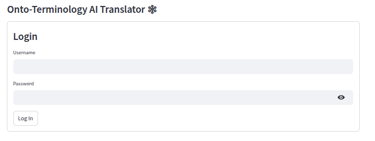
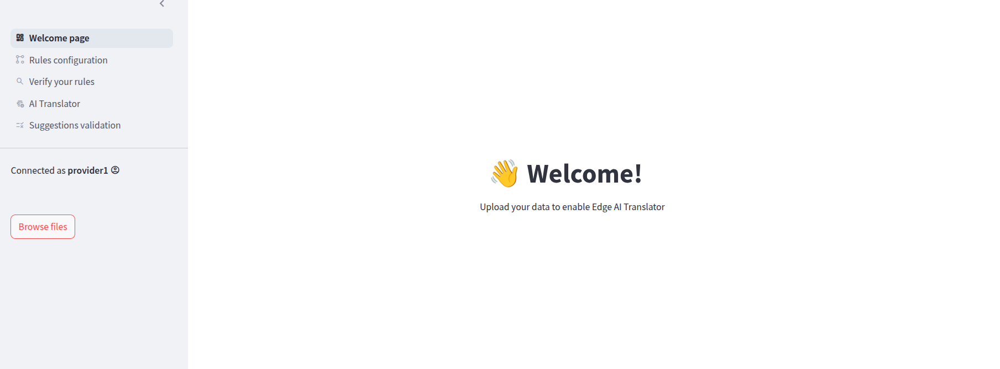
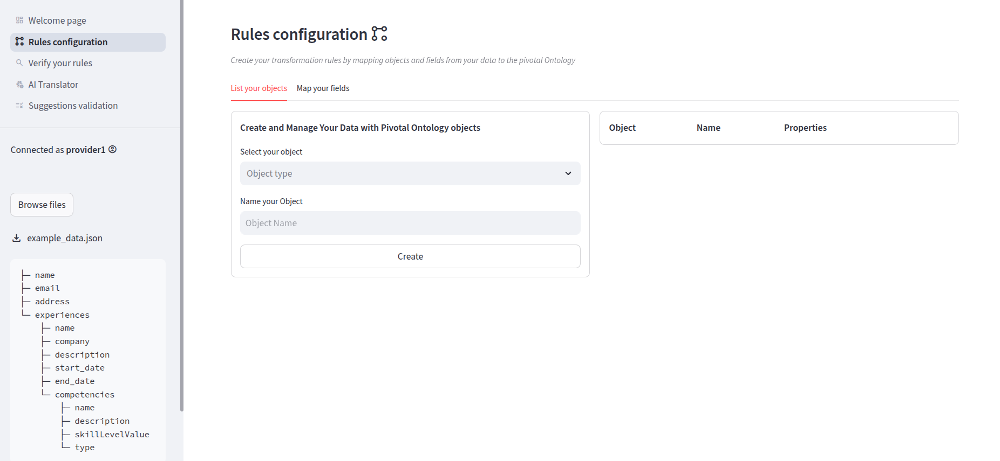
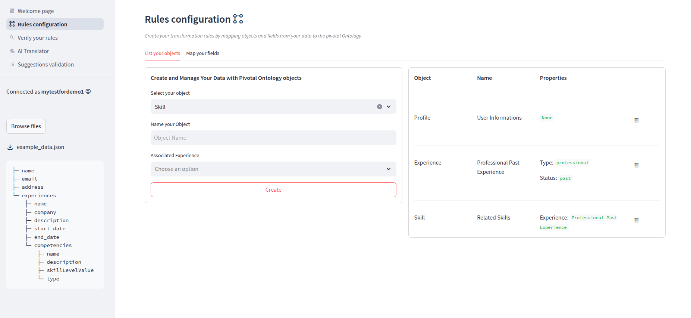
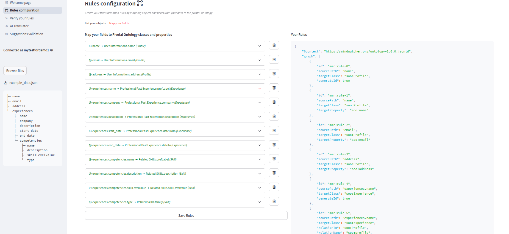
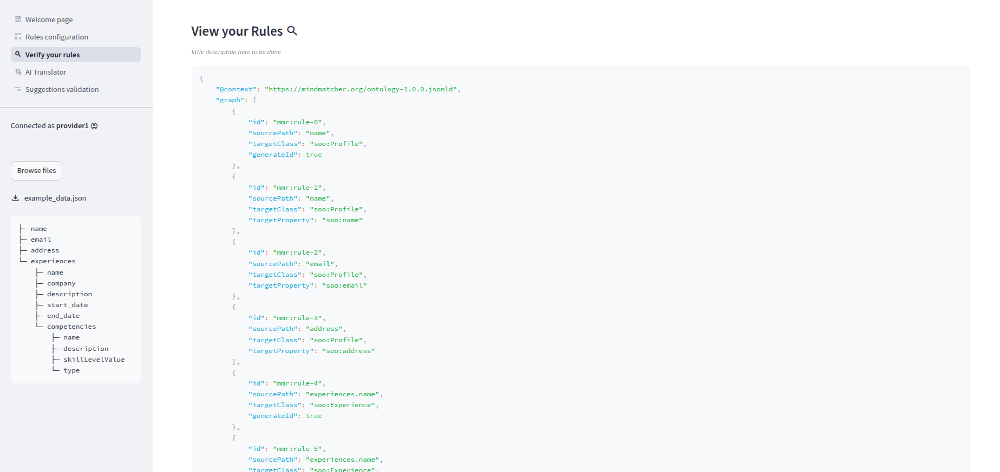
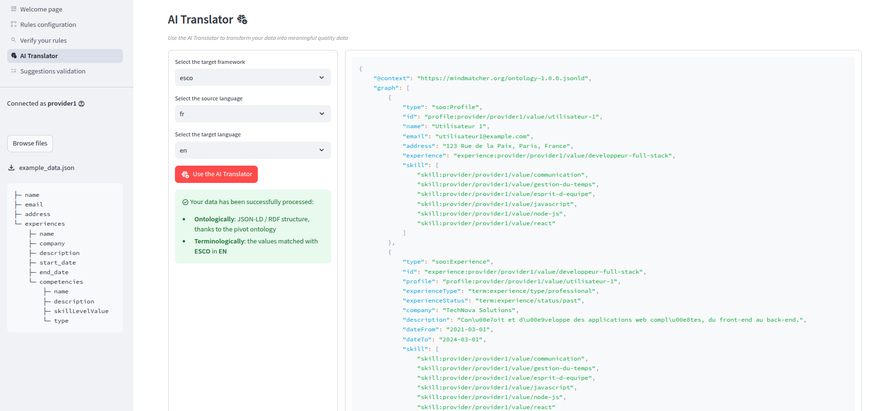
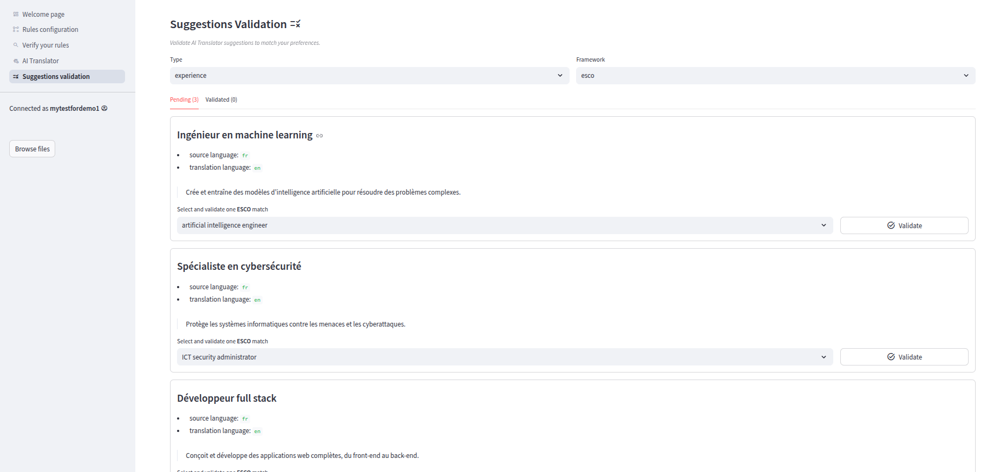
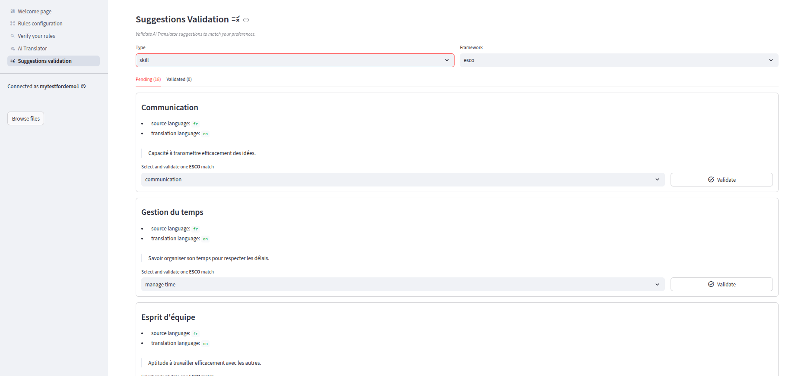

# Guide - How to use the AI Translator

Welcome 👋 This guide will help you get started with the AI ​​Translator tool.

- You can set up the **AI Translator on-premise**, using your own infrastructure, thus manage access yourself.
- Mindmatcher provides an **AI Translator cloud version** _(available online)_; to use it, you must first request access from Mindmatcher.

## 🔑 Credentials

The password uses `bcrypt` as the encryption algorithm.

### On-Premise
If you have set up the AI Translator on-premise _(using your infrastructure solution)_, you have to add a user in the PostgreSQL Database into the User table.

- **For development**: if you followed the set up steps in the README.md, fake data _(fixtures)_ has been loaded, you can use the user `provider1` and the password `changeme`.
- **For production**: use your prefered way to create the necessary user(s) into the `User` table as you would normally insert data in a SQL database.

### Cloud

If you use the AI Translator cloud version, ask Mindmatcher to provide you one (or more) account(s).

---

## 🔓 Logging In

- Go to the **login page** depending on the AI Translator environment
  - on-premise: your on-premise AI Translator UI url
  - cloud: [AI Translator UI](https://ai-translator-ui-934098617065.europe-west1.run.app/)
- Enter your credentials and click **Log In**



---

## 🧭 Steps overview

1. [Navigating the Welcome page](#-navigating-the-welcome-page)
2. [Set up your Translator Rules](#-set-up-your-translator-rules)
3. [View your Translator Rules](#-view-your-translator-rules)
4. [Use AI translator to improve and standardize your data](#-use-ai-translator-to-improve-and-standardize-your-data)
5. [Validate AI suggestions](#-validate-ai-suggestions)

---

## 🧭 Navigating the Welcome page

Once logged in, you’ll land on the **Welcome page**.

From here, you can:

- Browse a data sample
- Setup your Translator Rules according to the data sample
- Test the Translator on your data sample
- View and accept AI Suggestions



---

## 📁 Set up your Translator Rules

* Click **Browse files** button.
* Upload a data sample. This sample should have the same structure as real data you will use in production. You will be automatically redirected to the **“Rules configuration”** tab. You'll also see in the sidebar the data structure of your file.

* Now you need to map your data according to the Pivotal Ontology data model.
  * Define and list what objects your data is made of, each object needs a mandatory name:
    * **Profile**: for user informations
    * **Experience**: for each Experience, you need to set a **type** and a **status** 
      * **Types**: `Educational`, `Professional`, `Vocational` or `Personnality test`
      * **Status**: `Past`, `Ongoing` or `Suggested`
    * **Skill**: can be linked to an experience, or not depending on the type of data you have.
  
  * Then, you have to map your data fields to Pivotal Ontology properties. Thoses properties comes from the standard Pivotal Onology data model defined by Mindmatcher.
    * For "date type" properties, you need to give the format. For now we only handle 2 format: **big-endian-no-separator**: `YYYY-MM-DD` (default) and **year-only**: `YYYY`



In this example, to cover a large use case, our data is composed of user profiles, that have their past professional experiences attached, with a list of related skills attached:  
`Profiles>Experiences>Skills`

Here is the data source structure:
```json
├─ name
├─ email
├─ address
└─ experiences
    ├─ name
    ├─ company
    ├─ description
    ├─ start_date
    ├─ end_date
    └─ competencies
        ├─ name
        ├─ description
        ├─ skillLevelValue
        └─ type
```
So we needed to create 3 different objects: 
* **Profile**
  * name: `User Informations`
* **Experience**
  * name: `Professional Past Experience`
  * Type: `Professional`
  * Status: `Past`
* **Skill**
  * name: `Related Skills`
  * Associated Experience: `User Informations`

Then, we need to map the example sample data to Pivotal Ontology properties based on the Objects we've created previously:


| **Field source path**                      | **Object**                      | **Property**         | **Date Format**              |
|--------------------------------------------|---------------------------------|----------------------|------------------------------|
| `name`                                     | User Informations               | name                 |                              |
| `email`                                    | User Informations               | email                |                              |
| `address`                                  | User Informations               | address              |                              |
| `experiences.name`                         | Professional Past Experience    | prefLabel            |                              |
| `experiences.company`                      | Professional Past Experience    | company              |                              |
| `experiences.description`                  | Professional Past Experience    | description          |                              |
| `experiences.start_date`                   | Professional Past Experience    | dateFrom             | `big-endian-no-separator`    |
| `experiences.end_date`                     | Professional Past Experience    | dateTo               | `big-endian-no-separator`    |
| `experiences.competencies.name`            | Related Skills                  | prefLabel            |                              |
| `experiences.competencies.description`     | Related Skills                  | description          |                              |
| `experiences.competencies.skillLevelValue` | Related Skills                  | skillLevelValue      |                              |
| `experiences.competencies.type`            | Related Skills                  | family               |                              |

---

## 🔍 View your Translator Rules

You can view and verify your current Translator Rules in the **Verify your rules** tab



---

## 🪄 Use AI translator to improve and standardize your data

You can use the UI to test the Translator on you data sample. For production processings, you should use the API.

The purpose of the Translator processing, is that depending on the data and parameters you will send, the AI will try to find the best sementical matches.

The AI will give 5 suggestions, and consider 1 as the best match unless you decide to validate another one from the 5 given. See the [Validate AI suggestions](#-validate-ai-suggestions)


### From the UI 
* Go to the **AI Translator** tab
* Set Translator parameters
  * `Target Framework`
    * European framework: `esco` _(European Skills, Competences, Qualifications and Occupations)_
    * French framework: `rome` _(Répertoire Opérationnel des Métiers et des Emplois)_
  * `Source Language`: for informational purposes only, will be transcribed into output data
  * `Target Language`: for language translation on matching suggestions made by the AI to the target framework you've selected



### From the API

```bash
curl -X 'POST' \
  'https://ai-translator-api-934098617065.europe-west1.run.app/transform?target_framework=esco&language_source=fr&language_target=en' \
  -H 'accept: application/json' \
  -H 'Authorization: Bearer your-token' \
  -H 'Content-Type: application/json' \
  -d '{
  "document": [...fill_it_with_your_data...]
}'
```

Replace the empty array `"document": [...fill_it_with_your_data...]` with your data
- [Here the example we used](docs/data-examples/faketestprovider/data_full_3_profiles.json) in this guide
- Other data examples [available here](docs/data-examples/)

For on-premise deployments, replace `https://ai-translator-api-934098617065.europe-west1.run.app` by your Translator API url.

---

## 👍 Validate AI suggestions

- Go in the **Suggestions validation** tab to view


- According to the parameters you gave during Translator process and the type of data you processed, you can filter suggestions by `type` and `framework`
- Validate the suggestions that match your needs to help the AI for a better and personalized output
- Once you validated a suggestion, it will pass from **Pending** tab to **Validated** tab

- Validated suggestions will be stored, so now, each time you use the Translator:
  - either you already validated a match suggestion and it will give the validated suggestion as output
  - or it will add a new suggestion that you can validate
- If you dont do anything, the AI will provide 5 suggestions and automatically decide what is the best semmentical matching

---

### Well done, you finished this guide 🎉