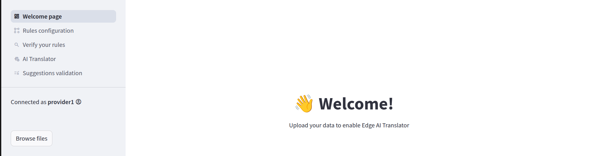
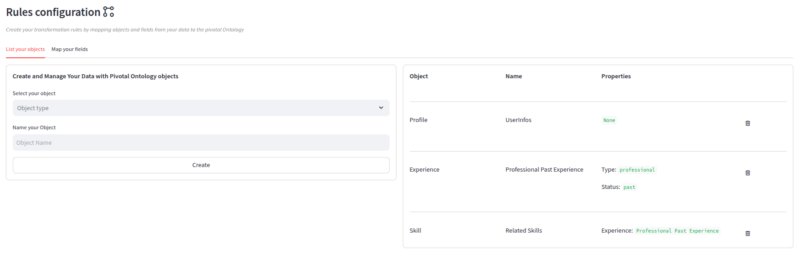

# How to use the AI Translator

## 📋 Table of Contents
- [Overview](#overview)
- [Logging In](#logging-in)
- [Navigating the Dashboard](#navigating-the-dashboard)
- [Key Features](#key-features)
  - [Creating a Project](#creating-a-project)
  - [Managing Users](#managing-users)
  - [Tracking Progress](#tracking-progress)
- [Tips and Best Practices](#tips-and-best-practices)
- [Shortcuts and Productivity](#shortcuts-and-productivity)
- [FAQ](#faq)
- [Need Help?](#need-help)

---

## 🧭 Overview

Welcome to **AI Translator**! This guide walks you through the main features, how to use them, and tips to get the most out of the platform.

---

## 🔐 Logging In

1. Go to [AI Translator UI](https://ai-translator-ui-934098617065.europe-west1.run.app/)
2. Enter your credentials and click **Log In**.
3. If you don't have an account, request access from Mindmatcher.

---

## 🧭 Navigating the Welcome page

Once logged in, you’ll land on the **Welcome page**. From here, you can:

- Browse a data sample
- Setup your Translator Rules regading your data sample
- Test the Translator on your data sample
- View and accept AI Suggestions

---

## 🚀 Key Features

### 📁 Rules configuration

1. Click **“Browse files”**
2. Upload a data sample that will be the same structure / format as real data you will use.
3. You will be automatically redirected to the **“Rules configuration”** tab
4. Now you need to explain what objects you have in your data sample according to the Pivotal Ontology => is it Skills ? and/or Experience (like work, courses, tests,..), and/or some Profile (user infos) ?
5. Fill in the required fields
   - Mandatory for all objects : name
   - Experience: type, status
   - Skill: Associated Experience (can be empty if its not related to an experience, like jsut a list of skills)
6. Click **Create** — your project will appear on the dashboard

### 👥 AI Translator

- Go to **Project Settings > Members**
- Click **Invite User**
- Assign roles: `Viewer`, `Editor`, or `Admin`

### 📊 Suggestions validation

- Use the **Progress** tab to view completion stats
- Tasks are color-coded by status
- Filters help you focus by priority, assignee, or deadline

---

## 💡 Tips and Best Practices

- Use **tags** to organize tasks
- Set **notifications** on critical updates
- Archive inactive projects to keep things clean

---

## ⌨️ Shortcuts and Productivity

| Action           | Shortcut          |
|------------------|-------------------|
| Open Command Bar | `Cmd + K` / `Ctrl + K` |
| Create New Item  | `N`               |
| Search           | `/`               |

---

## ❓ FAQ

**Q: Can I export data?**  
Yes! Go to **Settings > Export** and choose CSV or JSON.

**Q: Is there a mobile version?**  
Yes, available on iOS and Android.

---

## 🆘 Need Help?

- [User Documentation](https://docs.yourdomain.com)
- [Contact Support](mailto:support@yourdomain.com)
- Join our [Community](https://discord.gg/yourcommunity)

---
