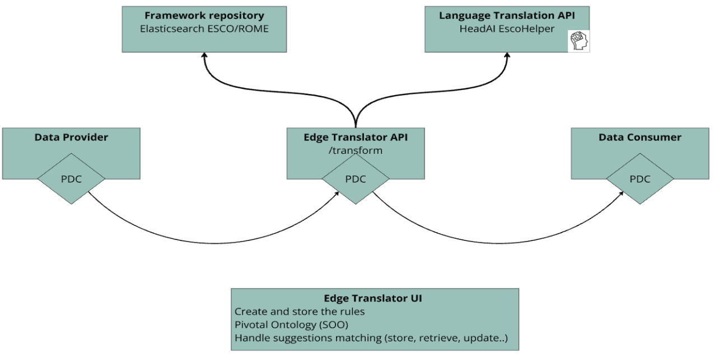
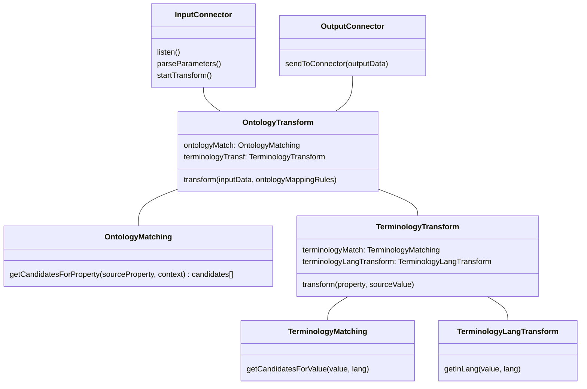
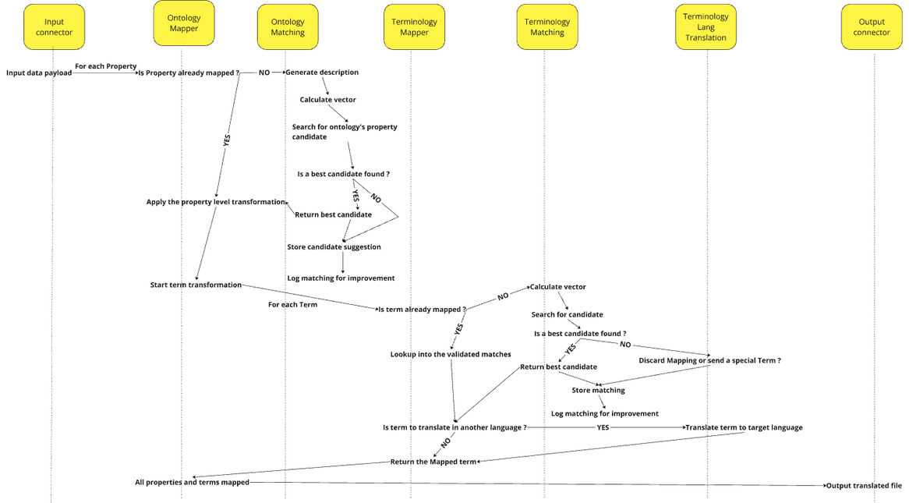
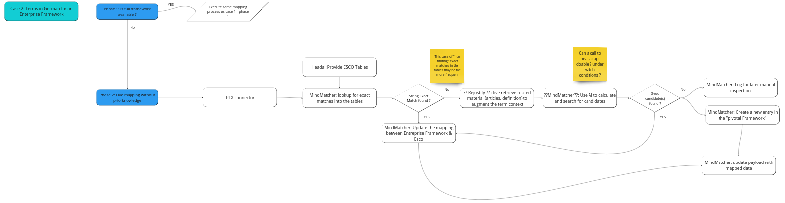
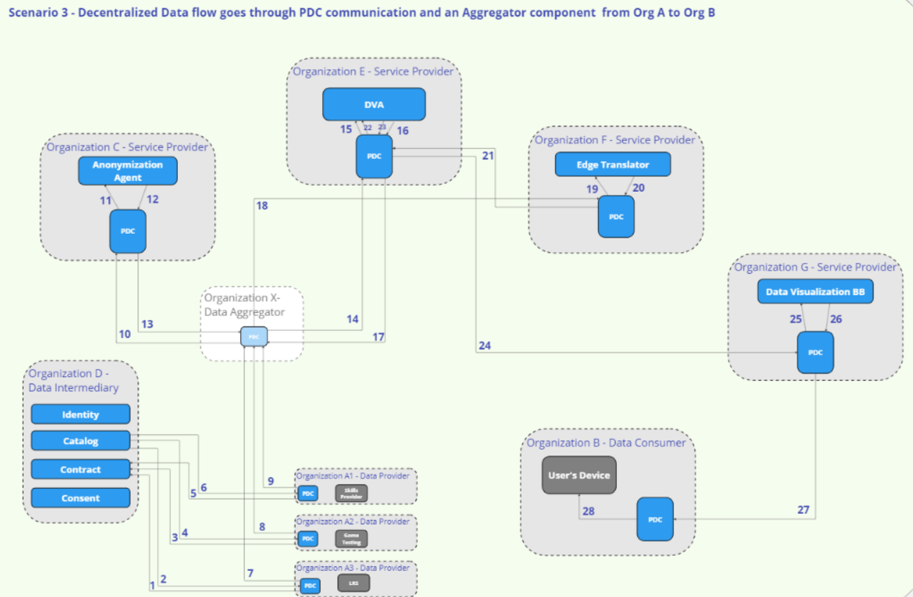

# Edge translators BB – Design Document

<!-- TOC start (generated with https://github.com/derlin/bitdowntoc) -->

- [Edge translators BB – Design Document](#edge-translators-bb--design-document)
   * [Technical usage scenarios & Features](#technical-usage-scenarios--features)
      + [Features/main functionalities](#featuresmain-functionalities)
      + [Technical usage scenarios](#technical-usage-scenarios)
   * [Requirements](#requirements)
   * [Integrations](#integrations)
      + [Direct Integrations with Other BBs](#direct-integrations-with-other-bbs)
      + [Integrations via Connector](#integrations-via-connector)
      + [Integration into the Connector Flow ](#integration-into-the-connector-flow)
   * [Relevant Standards](#relevant-standards)
      + [Data Format Standards](#data-format-standards)
      + [Mapping to Data Space Reference Architecture Models](#mapping-to-data-space-reference-architecture-models)
      + [Input / Output Data](#input--output-data)
   * [Architecture](#architecture)
   * [Dynamic Behaviour](#dynamic-behaviour)
   * [Configuration and deployment settings](#configuration-and-deployment-settings)
   * [Third Party Components & Licenses](#third-party-components--licenses)
   * [OpenAPI Specification](#openapi-specification)
   * [Test specification](#test-specification)
      + [Test plan](#test-plan)
      + [Unit tests](#unit-tests)
      + [Integration tests](#integration-tests)
   * [Partners & roles](#partners--roles)
   * [Usage in the dataspace](#usage-in-the-dataspace)

<!-- TOC end -->


The baseline of this building block is: “On Institutional Edges for AI Assisted Onto-Terminology Translators.”. 

The **AI Translator** is a tool to help us achieve **Frictionless Interoperability. **

In the data world, like in the spoken language world, translation require 2 abilities : 

* 1. Ability to understand the “content” (or values) in the data. In language it’s called vocabulary, we call it **Terminology**.
* 2. Ability to understand the “structure” (or data-model). In language it’s called grammar, we call it **Ontology**.
The mixture of these 2 abilities is called **Onto-Terminology**, as the capacity to translate the structure (ontology) and the content (terminology) of a data input.


To explain the spirit of this Building Block we will divide it into 3 sections : 

* **Onto-Terminology Translators:** computer services that translate the structure & the content of a data input to another format output. This is the digital twin of a human that translates a text from one language to another. 
* **AI Assisted:** ull translation of data is a tough task, and even if AI can deliver good automatic results, humans will always be here to control and fix if necessary. We will develop a concept of “Semantic Suggestions” to help communication between humans and translators pass smoothly.
* **On Institutional Edge:** ur long term vision is that Translators should be installable to any institutional edge infrastructure to ensure full compliance and availability. 

As a central part of the “common language”, the Ontology Editor will provide a community sourced and updated pivotal onto-terminology for all partners of the project.


## Technical usage scenarios & Features

The Edge Translator is the core component for the process of translating input data format and value to a standard output. 
This component will work in conjunction with others in order to provide best translations. These side-car components are the following 4 : 

* **The Ontology Editor** helps the community to define and share a common data-model for data exchanges. It helps any actor with documentation and API to understand and manipulate the RDFS data-model. This editor will grant online access to the Pivotal Ontology.
* **The Frameworks Repository** contains not only all the common frameworks of the community but also some specific ones. It provides access to the technical definition of the used terms (Job, Skill,...) to anyone.
* **The Onto-Terminology Mapping UI** is an application that allows data-providers to initiate the mapping of their data.
* **The Past Matching Validation UI** is an application that allows to view and validate the matchings done by the AI and then provide feedback for continuous training and improvement of the AI.

Within the PTX environment the Edge Translator can be schematised as: 



The more straightforward use-case for this Building Bloc is : 
- Company_1 work with english ESCO and want to hire some Frenchies (what a strange idea)
- Frenchie_1 made an online Skill Test. With PTX, Company_1 can retrieve the Test’s results. 
- But theses Test results words from an in-house framework (french characters unrelated to ESCO)
- In these test result there is this an In-house Skill like “Intégration au groupe”
- The Translator will lookup for semantically similar Skills into ESCO. Rank them, and return the results.
- At the end, Company_1 get a nice-Json (aka json-ld) file with the ESCO skill : it’s id (esco:fcc0a1c8-d36e-4f8e-b928-00d5bca10a47) and it’s label in english (develop design ideas as a group)


The rest of this document will focus on the Edge Translator component.


### Features/main functionalities

* Includes Prometheus-X Data Connector (PDC) for data exchange
* Translates data from different json input data to pivotal ontology and terminology
* Complies with W3C, European, and HRopen standards. 
* Provides Json-ld as output 
* Exports and shares interoperable data  
* Is integrated with the Frameworks Repository to provide accessible terms definition to data-consumer
* Is integrated with the Onto-Terminology UI for data mapping validation
* Is integrated with the Past Matching validation UI for AI training and improvement


### Technical usage scenarios

* Translation of data to ensure interoperability between different systems and applications
* Facilitation of data exchange within the community by providing a common data model
* Provision of documentation and APIs for understanding and manipulating RDFS data models
* Allow data-consumer to implement one data-model integration and be able to connect to multiple data-sources.
* Allow data-consumer to ask for a language translation of value into a target language (it will focus on French, German and English for now)


## Requirements

* Translator MUST translate input data structure to the pivotal one
* Translator MUST transform skills & jobs related data in json to json-ld 
* Translator MUST log the mappings done 
* Translator MUST provide configuration option to select the output terminology & language, the activation of complementary services
* Translator MUST interact with PDC
* Translator SHOULD collect concepts that come from specific (not shared) terminologies
* Translator SHOULD be able to connect to external stock data to transform

## Integrations

See [01_BB Connections](https://docs.google.com/spreadsheets/d/1iNFLRofdwmrgNZ7E2JPSW0PL8xIUU4EVqIt-sMo9nlk/edit#gid=0) spreadsheet


### Direct Integrations with Other BBs

BB 9b LOMCT & BB 7 Distributed data visualization may have direct connection to the PDC. 

### Integrations into the PDC Flow

The translation service has a specific position inside the actual flow of the PDC. It acts as an intermediary for an exchange between a data-provider and a data-consumer. 
In order to take into account this specific situation, we will closely follow the evolution of PTX”s “Protocol Component as it may be a solution to orchestrate the Translator’s required flow.

## Relevant Standards


### Data Format Standards


* Json (as input format)
* [Json-ld](https://json-ld.org/) (as output format)
* [RDF](https://en.wikipedia.org/wiki/RDF_Schema) (to describe data)
* [RDFS](https://en.wikipedia.org/wiki/Resource_Description_Framework) (for defining ontologies)
* Well known ontologies (like [skos](https://en.wikipedia.org/wiki/Simple_Knowledge_Organization_System), [schema.org](schema.org), ESCO,...)


### Mapping to Data Space Reference Architecture Models

* DSSC : [Data Model](https://dssc.eu/space/BVE/357075098/Data+Models) and partly [Data Exchange](https://dssc.eu/space/BVE/357075193/Data+Exchange)
* IDS RAM : [3.2 Functional Layer](https://docs.internationaldataspaces.org/ids-knowledgebase/v/ids-ram-4/layers-of-the-reference-architecture-model/3-layers-of-the-reference-architecture-model/3_2_functionallayer) and more precisely 3/ Ecosystem of Data and 4/ Standardised interoperability


### Input / Output Data

There are 3 categories of inputs for this building block: 
* *The data provider input*. This input should be json. This input data can be any structure. Only one restriction applies on the keys of the json. These keys have to be “real keys” and not “data as key”. This mean that json structure where keys are used to provide dynamic data can’t be parsed; 
* *The ontology transformations rules*. These rules are generated by the Onto-terminology Mapping UI and will respect the definition of the Rules Ontology and will contain acceptable values for the translator.
* *The terms values and associated matchings from the Framework Repository*. This data will be structured by the Skos and the Matching Ontologies as json-ld compliant format. 

As output, 3 main categories of data will be produced: 
* *The transformation result file*. Provided to the data-consumer, this json-ld file will be structured as the Shared Ontology and will contain semantic data as well as the source data.
* *The Matching suggestions*: in order to act as a logging system and be able to improve the AI & algorithm iteratively, the translator will store the matching suggestion into a standard format. These suggestions can then be reviewed and validated by humans or replayed to validate improvement of the translator’s transformations.   
* *The mappings logs*: These logs will track the mapped and unmapped data in the source file. This information will help to track the percentage of mapped properties (completeness) and to analyze the mappings done on a global overview and so to check the correctness, accuracy and consistency of mappings done by the parties.  


## Architecture

At a high descriptive level of the internals of Edge Translator we can identify this components: 



These components then use the API and data provided by Headai & Rejustify to provide their features.

The detailed séquence diagram for theses components is : 



## Dynamic Behaviour

The following diagrams show 2 concrete examples for the Terminology (or Framework) transformation process. 

*The first case* details the process when a national framework is available and can be mapped before the connection of the data-source. 


*The second case* details the process when an internal, not broadly available framework is used to describe the source data. The live mappings are then conducted and are available for later inspection.





## Configuration and deployment settings
**Deployment**: The deployment of the translator will be done through docker containers. Even if the translator will work on CPU, it would be better for deployment to have GPU available. 
As a dependency, ElasticSearch will have to be deployed independently (on premise or cloud deployment available). 
Translator’s companion apps can be deployed to any infrastructure through docker containers. 

**Logging and Operations**:  The Translator will log operations, errors, and warnings to standard output and / or a cloud logging system. Logging includes details such as incoming & output requests, calls to main components, calls to external api, ontology and terminology transformation traces. Error scenarios, such as failed input request, error during structure or value transformation, failed queries to dependent components, …. are logged with appropriate error codes and descriptions to aid in troubleshooting and debugging.


## Third Party Components & Licenses

The main Third Parties that will be used are: 
* Elasticsearch : licenced as [Elastic License v2 & SSPL](https://github.com/elastic/elasticsearch/tree/main/licenses)
* Esco : licenced as [Commission Decision of 12 December 2011](https://esco.ec.europa.eu/en/use-esco/download) on the reuse of Commission documents (2011/833/EU)
* Rome: licenced under an [Open Data Licence](https://www.francetravail.org/files/live/sites/peorg/files/documents/Statistiques-et-analyses/Open-data/ROME/rome_licence_ouverte.pdf) 
* Ariane related modules : licenced under MIT

See [detailed documentation here](https://docs.google.com/spreadsheets/d/13Lf4PfVnA_lAk-7dMeIy0QRxHnarxMcsS8EaLjyOlBA/edit#gid=2045658592).


## OpenAPI Specification
* API specification version 0.1.0
<details>

<summary>Click to open the full spec</summary>

```json
{
  "openapi": "3.1.0",
  "info": {
    "title": "FastAPI",
    "version": "0.1.0"
  },
  "paths": {
    "/ontologies/get_mapping_rules": {
      "get": {
        "summary": "Ontologies.Get Mapping Rules",
        "operationId": "ontologies_get_mapping_rules_ontologies_get_mapping_rules_get",
        "parameters": [
          {
            "description": "Name of the data provider",
            "required": true,
            "schema": {
              "type": "string",
              "title": "Provider Name",
              "description": "Name of the data provider"
            },
            "name": "provider_name",
            "in": "query"
          },
          {
            "description": "the document type ",
            "required": false,
            "schema": {
              "type": "string",
              "title": "Document Type",
              "description": "the document type "
            },
            "name": "document_type",
            "in": "query"
          },
          {
            "description": "Version of the rules",
            "required": false,
            "schema": {
              "type": "string",
              "title": "Version",
              "description": "Version of the rules"
            },
            "name": "version",
            "in": "query"
          }
        ],
        "responses": {
          "200": {
            "description": "Successful Response",
            "content": {
              "application/json": {
                "schema": {
                  "items": {
                    "type": "object"
                  },
                  "type": "array",
                  "title": "Response Ontologies Get Mapping Rules Ontologies Get Mapping Rules Get"
                }
              }
            }
          },
          "422": {
            "description": "Validation Error",
            "content": {
              "application/json": {
                "schema": {
                  "$ref": "#/components/schemas/HTTPValidationError"
                }
              }
            }
          }
        }
      }
    },
    "/ontologies/get_jsonld_from_mapping_rules": {
      "post": {
        "summary": "Ontologies.Get Jsonld From Mapping Rules",
        "operationId": "ontologies_get_jsonld_from_mapping_rules_ontologies_get_jsonld_from_mapping_rules_post",
        "parameters": [
          {
            "required": false,
            "schema": {
              "type": "string",
              "title": "Version"
            },
            "name": "version",
            "in": "query"
          }
        ],
        "requestBody": {
          "content": {
            "application/json": {
              "schema": {
                "$ref": "#/components/schemas/Body_ontologies_get_jsonld_from_mapping_rules_ontologies_get_jsonld_from_mapping_rules_post"
              }
            }
          },
          "required": true
        },
        "responses": {
          "200": {
            "description": "Successful Response",
            "content": {
              "application/json": {
                "schema": {
                  "type": "object",
                  "title": "Response Ontologies Get Jsonld From Mapping Rules Ontologies Get Jsonld From Mapping Rules Post"
                }
              }
            }
          },
          "422": {
            "description": "Validation Error",
            "content": {
              "application/json": {
                "schema": {
                  "$ref": "#/components/schemas/HTTPValidationError"
                }
              }
            }
          }
        }
      }
    },
    "/ontologies/get_jsonld_from_provider": {
      "post": {
        "summary": "Ontologies.Get Jsonld From Provider",
        "operationId": "ontologies_get_jsonld_from_provider_ontologies_get_jsonld_from_provider_post",
        "parameters": [
          {
            "description": "Name of the data provider",
            "required": true,
            "schema": {
              "type": "string",
              "title": "Provider Name",
              "description": "Name of the data provider"
            },
            "name": "provider_name",
            "in": "query"
          },
          {
            "description": "Version of the rules",
            "required": false,
            "schema": {
              "type": "string",
              "title": "Version",
              "description": "Version of the rules"
            },
            "name": "version",
            "in": "query"
          }
        ],
        "requestBody": {
          "content": {
            "application/json": {
              "schema": {
                "$ref": "#/components/schemas/Body_ontologies_get_jsonld_from_provider_ontologies_get_jsonld_from_provider_post"
              }
            }
          },
          "required": true
        },
        "responses": {
          "200": {
            "description": "Successful Response",
            "content": {
              "application/json": {
                "schema": {
                  "type": "object",
                  "title": "Response Ontologies Get Jsonld From Provider Ontologies Get Jsonld From Provider Post"
                }
              }
            }
          },
          "422": {
            "description": "Validation Error",
            "content": {
              "application/json": {
                "schema": {
                  "$ref": "#/components/schemas/HTTPValidationError"
                }
              }
            }
          }
        }
      }
    },
    "/ontologies/helloworld": {
      "get": {
        "summary": "Ontologies.Get Hello World",
        "operationId": "ontologies_get_hello_world_ontologies_helloworld_get",
        "parameters": [
          {
            "required": true,
            "schema": {
              "type": "string",
              "title": "Name"
            },
            "name": "name",
            "in": "query"
          }
        ],
        "responses": {
          "200": {
            "description": "Successful Response",
            "content": {
              "application/json": {
                "schema": {
                  "type": "string",
                  "title": "Response Ontologies Get Hello World Ontologies Helloworld Get"
                }
              }
            }
          },
          "422": {
            "description": "Validation Error",
            "content": {
              "application/json": {
                "schema": {
                  "$ref": "#/components/schemas/HTTPValidationError"
                }
              }
            }
          }
        }
      }
    },
    "/machine_learning/get_embedding_vectors_from_sentences_from_flask": {
      "post": {
        "summary": "Embeddings.Get Embedding Vector From Sentences From Flask",
        "operationId": "embeddings_get_embedding_vector_from_sentences_from_flask_machine_learning_get_embedding_vectors_from_sentences_from_flask_post",
        "requestBody": {
          "content": {
            "application/json": {
              "schema": {
                "$ref": "#/components/schemas/Body_embeddings_get_embedding_vector_from_sentences_from_flask_machine_learning_get_embedding_vectors_from_sentences_from_flask_post"
              }
            }
          },
          "required": true
        },
        "responses": {
          "200": {
            "description": "Successful Response",
            "content": {
              "application/json": {
                "schema": {
                  "type": "object",
                  "title": "Response Embeddings Get Embedding Vector From Sentences From Flask Machine Learning Get Embedding Vectors From Sentences From Flask Post"
                }
              }
            }
          },
          "422": {
            "description": "Validation Error",
            "content": {
              "application/json": {
                "schema": {
                  "$ref": "#/components/schemas/HTTPValidationError"
                }
              }
            }
          }
        }
      }
    },
    "/machine_learning/get_embedding_vectors_from_sentences": {
      "post": {
        "summary": "Embeddings.Get Embedding Vector From Sentences",
        "operationId": "embeddings_get_embedding_vector_from_sentences_machine_learning_get_embedding_vectors_from_sentences_post",
        "requestBody": {
          "content": {
            "application/json": {
              "schema": {
                "$ref": "#/components/schemas/Body_embeddings_get_embedding_vector_from_sentences_machine_learning_get_embedding_vectors_from_sentences_post"
              }
            }
          },
          "required": true
        },
        "responses": {
          "200": {
            "description": "Successful Response",
            "content": {
              "application/json": {
                "schema": {
                  "type": "object",
                  "title": "Response Embeddings Get Embedding Vector From Sentences Machine Learning Get Embedding Vectors From Sentences Post"
                }
              }
            }
          },
          "422": {
            "description": "Validation Error",
            "content": {
              "application/json": {
                "schema": {
                  "$ref": "#/components/schemas/HTTPValidationError"
                }
              }
            }
          }
        }
      }
    },
    "/machine_learning/get_knn_from_elasticsearch_for_embedding": {
      "post": {
        "summary": "Embeddings.Get Knn From Elasticsearch For Embedding",
        "operationId": "embeddings_get_knn_from_elasticsearch_for_embedding_machine_learning_get_knn_from_elasticsearch_for_embedding_post",
        "requestBody": {
          "content": {
            "application/json": {
              "schema": {
                "$ref": "#/components/schemas/Body_embeddings_get_knn_from_elasticsearch_for_embedding_machine_learning_get_knn_from_elasticsearch_for_embedding_post"
              }
            }
          },
          "required": true
        },
        "responses": {
          "200": {
            "description": "Successful Response",
            "content": {
              "application/json": {
                "schema": {
                  "type": "object",
                  "title": "Response Embeddings Get Knn From Elasticsearch For Embedding Machine Learning Get Knn From Elasticsearch For Embedding Post"
                }
              }
            }
          },
          "422": {
            "description": "Validation Error",
            "content": {
              "application/json": {
                "schema": {
                  "$ref": "#/components/schemas/HTTPValidationError"
                }
              }
            }
          }
        }
      }
    },
    "/machine_learning/get_knn_from_elasticsearch_for_vector": {
      "post": {
        "summary": "Embeddings.Get Knn From Elasticsearch For Vector",
        "operationId": "embeddings_get_knn_from_elasticsearch_for_vector_machine_learning_get_knn_from_elasticsearch_for_vector_post",
        "requestBody": {
          "content": {
            "application/json": {
              "schema": {
                "$ref": "#/components/schemas/Body_embeddings_get_knn_from_elasticsearch_for_vector_machine_learning_get_knn_from_elasticsearch_for_vector_post"
              }
            }
          },
          "required": true
        },
        "responses": {
          "200": {
            "description": "Successful Response",
            "content": {
              "application/json": {
                "schema": {
                  "type": "object",
                  "title": "Response Embeddings Get Knn From Elasticsearch For Vector Machine Learning Get Knn From Elasticsearch For Vector Post"
                }
              }
            }
          },
          "422": {
            "description": "Validation Error",
            "content": {
              "application/json": {
                "schema": {
                  "$ref": "#/components/schemas/HTTPValidationError"
                }
              }
            }
          }
        }
      }
    }
  },
  "components": {
    "schemas": {
      "Body_embeddings_get_embedding_vector_from_sentences_from_flask_machine_learning_get_embedding_vectors_from_sentences_from_flask_post": {
        "properties": {
          "embedding": {
            "allOf": [
              {
                "$ref": "#/components/schemas/EmbeddingPayload"
              }
            ],
            "title": "Embedding",
            "description": "the text to transform"
          }
        },
        "type": "object",
        "required": [
          "embedding"
        ],
        "title": "Body_embeddings_get_embedding_vector_from_sentences_from_flask_machine_learning_get_embedding_vectors_from_sentences_from_flask_post"
      },
      "Body_embeddings_get_embedding_vector_from_sentences_machine_learning_get_embedding_vectors_from_sentences_post": {
        "properties": {
          "embedding": {
            "allOf": [
              {
                "$ref": "#/components/schemas/EmbeddingPayload"
              }
            ],
            "title": "Embedding",
            "description": "the text to transform"
          }
        },
        "type": "object",
        "required": [
          "embedding"
        ],
        "title": "Body_embeddings_get_embedding_vector_from_sentences_machine_learning_get_embedding_vectors_from_sentences_post"
      },
      "Body_embeddings_get_knn_from_elasticsearch_for_embedding_machine_learning_get_knn_from_elasticsearch_for_embedding_post": {
        "properties": {
          "embedding": {
            "allOf": [
              {
                "$ref": "#/components/schemas/EmbeddingPayload"
              }
            ],
            "title": "Embedding",
            "description": "the text to match"
          }
        },
        "type": "object",
        "required": [
          "embedding"
        ],
        "title": "Body_embeddings_get_knn_from_elasticsearch_for_embedding_machine_learning_get_knn_from_elasticsearch_for_embedding_post"
      },
      "Body_embeddings_get_knn_from_elasticsearch_for_vector_machine_learning_get_knn_from_elasticsearch_for_vector_post": {
        "properties": {
          "embedding_vector": {
            "type": "object",
            "title": "Embedding Vector",
            "description": "the vector to match"
          }
        },
        "type": "object",
        "required": [
          "embedding_vector"
        ],
        "title": "Body_embeddings_get_knn_from_elasticsearch_for_vector_machine_learning_get_knn_from_elasticsearch_for_vector_post"
      },
      "Body_ontologies_get_jsonld_from_mapping_rules_ontologies_get_jsonld_from_mapping_rules_post": {
        "properties": {
          "mapping_rules": {
            "type": "object",
            "title": "Mapping Rules",
            "description": "the mapping rules"
          },
          "document": {
            "anyOf": [
              {
                "items": {
                  "type": "object"
                },
                "type": "array"
              },
              {
                "type": "object"
              }
            ],
            "title": "Document",
            "description": "the document"
          }
        },
        "type": "object",
        "required": [
          "mapping_rules",
          "document"
        ],
        "title": "Body_ontologies_get_jsonld_from_mapping_rules_ontologies_get_jsonld_from_mapping_rules_post"
      },
      "Body_ontologies_get_jsonld_from_provider_ontologies_get_jsonld_from_provider_post": {
        "properties": {
          "document": {
            "anyOf": [
              {
                "items": {
                  "type": "object"
                },
                "type": "array"
              },
              {
                "type": "object"
              }
            ],
            "title": "Document",
            "description": "the document"
          }
        },
        "type": "object",
        "required": [
          "document"
        ],
        "title": "Body_ontologies_get_jsonld_from_provider_ontologies_get_jsonld_from_provider_post"
      },
      "EmbeddingPayload": {
        "properties": {
          "sentences": {
            "items": {
              "type": "string"
            },
            "type": "array",
            "title": "Sentences",
            "description": "List of texts to embed",
            "example": [
              "Bonjour, comment ça va?"
            ]
          }
        },
        "type": "object",
        "required": [
          "sentences"
        ],
        "title": "EmbeddingPayload",
        "description": "Intended for use as a base class for externally-facing models.\n\nAny models that inherit from this class will:\n* accept fields using snake_case or camelCase keys\n* use camelCase keys in the generated OpenAPI spec\n* have orm_mode on by default\n    * Because of this, FastAPI will automatically attempt to parse returned orm instances into the model"
      },
      "HTTPValidationError": {
        "properties": {
          "detail": {
            "items": {
              "$ref": "#/components/schemas/ValidationError"
            },
            "type": "array",
            "title": "Detail"
          }
        },
        "type": "object",
        "title": "HTTPValidationError"
      },
      "ValidationError": {
        "properties": {
          "loc": {
            "items": {
              "anyOf": [
                {
                  "type": "string"
                },
                {
                  "type": "integer"
                }
              ]
            },
            "type": "array",
            "title": "Location"
          },
          "msg": {
            "type": "string",
            "title": "Message"
          },
          "type": {
            "type": "string",
            "title": "Error Type"
          }
        },
        "type": "object",
        "required": [
          "loc",
          "msg",
          "type"
        ],
        "title": "ValidationError"
      }
    }
  }
}
```

</details>


## Test specification
### Test plan
See [specific document](https://docs.google.com/document/d/1_kgb8CnV1rWnnxHC3EbGbp50ygiJExdIKGtRu-iZSxE/edit) on test plan
The main tests scenarios will cover: 
- Translated Outputs : Snapshot testing
- AI & functionals : Unit-tested
- Internal API calls : Integration tests
- API endpoint : Postman collections
- Perf Caching : load tests.


### Unit tests
Unit tests will be set-up on a range of sample data to ensure non-regression during the development. These unit tests will take as input an example of a data provider and the output of the transformation will be checked against a static output file.

These tests will be executed with Pytest. 
Extensive examples of data input and output are [available here](https://github.com/Prometheus-X-association/edge-translators/tree/main/docs/data-examples)

Example of input data file (in json) 
```json 
[
  {
	"Experience Name": "Problem-Solving Puzzle",
	"User ID": "xx.yy@gmail.com",
	"Date": "2023-06-28",
	"Associated Soft Skill Block": "Problem-Solving",
	"Results": "Validated"
  }
]
``` 
Example of output data file (in json-ld)
``` json
{
  "@context": {
	"id": "@id",
	"graph": {
  	"@id": "@graph",
  	"@container": "@set"
	},
	"type": {
  	"@id": "@type",
  	"@container": "@set"
	},
	"tr": "https://competencies.be/mindmatcher/translator",
	"mms": "https://competencies.be/mindmatcher/schema",
	"date": {
  	"@id": "mms:date",
  	"@type": "xsd:dateTime"
	},
	"keywords": {
  	"@id": "mms:keywords",
  	"@type": "xsd:string"
	},
	"picture": {
  	"@id": "mms:picture",
  	"@type": "xsd:string"
	},
	"title": {
  	"@id": "mms:title",
  	"@type": "xsd:string"
	},
	"url": {
  	"@id": "mms:url",
  	"@type": "xsd:string"
	}

  },
  "graph": [
	{
  	"id": "tr:__generated-id-1__",
  	"type": "soo:Experience",
  	"prefLabel": {"@value": "Problem-Solving Puzzle", "@language": "en"},
  	"profile": "tr:__profile-id-1__",
  	"dateFrom": "2023-06-28",
  	"skill": "tr:__skill-id-1__",
  	"result": "Validated"
	},
	{
  	"id":"tr:__profile-id-1__",
  	"type": "soo:Profile",
  	"email":"xx.yy@gmail.com",
  	"experience": "tr:__generated-id-1__"
	},
	{
  	"id": "tr:__skill-id-1",
  	"type": "soo:Skill",
  	"experience": "tr:__generated-id-1__",
  	"sourceValue": "tr:__source-value-1",
  	"mapping": "esco:adc6dc11-3376-467b-96c5-9b0a21edc869",
  	"suggestions": [ "tr:sugg/1", "tr:sugg/2"],
  	"skillLevelValue": "Validated"
	},
	{
  	"id": "tr:__source-value-1",
  	"label": "Problem-Solving"
	},
	{
  	"id": "esco:adc6dc11-3376-467b-96c5-9b0a21edc869",
  	"type": "esco:Skill",
  	"prefLabel": {"@value": "solve problems", "@language": "en"}
	},
	{
  	"id":"tr:sugg/1",
  	"type": "mms:Suggestion",
  	"source": "mm-search",
  	"score": 35,
  	"mapping": "esco:adc6dc11-3376-467b-96c5-9b0a21edc869"
	},
	{
  	"id":"tr:sugg/2",
  	"type": "mms:Suggestion",
  	"source": "mm-search",
  	"score": 10,
  	"mapping": "esco:1234"
	}
  ]
}
```

### Integration tests
Integration tests conducted with the setup of “fake application” and the automated call of an exchange. This possibility will depend on the ability of PDC to provide a way to automate such exchanges (not possible as of today).
These integration tests will be run by a python or JavaScript script. They may also be runned with Postman.

## Partners & roles
MindMatcher : 
* BB leader
* Organize workshops, monitor partner progress
* Develop main features of the BB, connect BB to Dataspace, setup infrastructure

Headai : 
* Participate in technical design
* Provide mapping tables 
* Provides Esco-focused translation between Esco languages. That is not just a word-to-word  translation, it understands simple morphological and semantic issues (lightweight LM)
* Develop connection to their proprietary API


Rejustify :
* Participate in technical design
* Provide test data 
* Gather and aggregate some partners data

## Usage in the dataspace
Translator can be used in case of aggregation of different data-sources, in order to get a uniform data-format and facilitate the processing of data from different sources.



In the given scenario Use Case Orchestrator has also the role of the Data Provider and Data Consumer.
1. As Use Case Orchestrator the Org A selects the required services from the Catalog
2. As Use Case Orchestrator the Org A signs the Contract
3. The Data Processing Chain Protocol is defined together with the Org A
4. After signing the contract the Org A will have a PDC and by acting as Data Provider will send the raw data to the first service provider's PDC (Org C PDC)
5. Org C's PDC communicated the raw data with the service provider
6. Org. C's PDC receives the anonymized data back
7. As defined by Data Processing Chain Protocol first service provider (Org.C), after processing the data, checks the next recipient and pushes the processed data to the next service provider's PDC (Org D Data Vacity Assurance)
8. Org D's PDC requests for the Attestation of Veracity (AoV)
9. Proof of Veracity (PoV) is provided
10. As defined by Data Processing Chain Protocol the data flow is double checked between the Service Provider and DPCP and pushed to the next service provider (Org E Edge Translator)
11. Org E's PDC forwards the raw, anonymized data to Edge Translator BB
12. Output data is generated (Json-ld) and forwarded to the PDC of the EdgeTranslator BB
13. Translated data (Json-ld in Pivotal Ontology) is forwarded back to DVA's PDC for double verification
14. Data is pushed to DVA requesting AoV
15. PoV is provided
16. DVA's PDC Transfers data to the Visualisation BB's PDS to process it
17. Visualization BB's PDC pushes the data into the Visualization BB
18. Already processed data returns to the PDC ready to be distributed
19. Service provider's PDC (Org F) forwards final data to the Data Consumer's device, ready to be displayed
