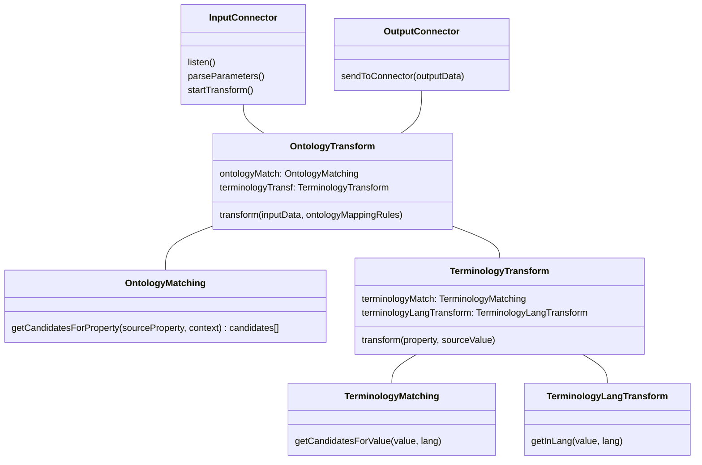

# Edge translators BB – Design Document


[TOC]


The baseline of this building block is: “On Institutional Edges for AI Assisted Onto-Terminology Translators.”. 

The **AI Translator** is a tool to help us achieve **Frictionless Interoperability. **

In the data world, like in the spoken language world, translation require 2 abilities : 

* 1/ Ability to understand the “content” (or values) in the data. In language it’s called vocabulary, we call it **Terminology**.
* 2/ Ability to understand the “structure” (or data-model). In language it’s called grammar, we call it **Ontology**.

To explain the spirit of this Building Block we will divide it into 3 sections : 


* **Onto-Terminology Translators: ** computer services that translate the structure & the content of a data input to another format. This is the digital twin of a human that translates a text from one language to another. 
* **AI Assisted:** full translation of data is a tough thing, and even if AI can make good automatic results, humans will always be here to control and fix some things. We will develop a concept of “Semantic Suggestions” to help communication between humans and translators. 
* **On Institutional Edge:** our long term vision is that Translators should be installable to any institutional edge infrastructure to ensure full compliance and possibility. 

As a central part of the “common language”, the Ontology Editor will provide a community sourced and updated pivotal onto-terminology for all partners of the project.


## Technical usage scenarios & Features

The Edge Translator is the core component for the process of translating input data format and value to a standard output one. 

This component will work in conjunction with others in order to provide best translations. These side-car components are the following 4 : 


* **The Ontology Editor** helps the community to define and share a common data-model for data exchanges. It helps any actor with documentation and API to understand and manipulate the RDFS data-model.
* **The Frameworks Repository** contains not only all the usual frameworks of the community but also the specifics ones. It provides to anyone the access to the technical definition of the used terms (Job, Skill,...).
* **The Onto-Terminology Mapping UI** is an application that allows data-provider to validate the mapping suggestions done by the AI or to create new ones.
* **The Past Mappings validation UI** is an application that allows to view and validate the mappings done by the AI and then provide feedback for continuous training and improvement of the AI.

With the environment of PTX, the Edge Translator environment can be schematised as: 


The rest of this document will focus on the Edge Translator component.


### Features/main functionalities

* Includes PTX Connectors for data exchange
* Translates data between different json input data to pivotal ontology and terminology
* Provides an Edge Translator for data transformation
* Complies with W3C, European, and HRopen standards. Provides Json-ld as output 
* Exports and shares interoperable data  
* Is integrated with the Frameworks Repository to provide accessible terms definition to data-consumer
* Is integrated with the Onto-Terminology UI for data mapping validation
* Is integrated with the Past Mappings validation UI for AI training and improvement


### Technical usage scenarios

* Translation of data for interoperability between different systems and applications
* Facilitation of data exchange within the community by providing a common data model
* Provision of documentation and APIs for understanding and manipulating RDFS data models
* Allow data-consumer to implement one data-model integration and be able to connect to multiple data-sources.
* Allow data-consumer to ask for a language translation of value into a target language (it will focus on French, German and English for now)


## Requirements

* Translator MUST transform skills & jobs related data in json to json-ld 
* Translator MUST log the mappings done 
* Translator MUST provide configuration option to select the output terminology & language, the activation of complementary services
* Translator MUST interface with Dataspace Connector
* Translator SHOULD collect concepts that come from specific (not shared) terminologies
* Translator SHOULD be able to to connect to external stock data to transform


## Integrations

See [01_BB Connections](https://docs.google.com/spreadsheets/d/1iNFLRofdwmrgNZ7E2JPSW0PL8xIUU4EVqIt-sMo9nlk/edit#gid=0) spreadsheet


### Direct Integrations with Other BBs

BB 9b LOMCT & BB 7 Distributed data visualisation may have direct connection to the connector. 


### Integrations via Connector

Integrations with connectors may be done in the use-case of IMC, GEN or Schülerkarriere.


### Integration into the Connector Flow 

The translation service has a specific position into the actual flow of the Connector. The Translation service acts in the middle of an exchange between a data-provider and a data-consumer. 

In order to take into account this specific situation an evolution of the Contract component has to be done.


## Relevant Standards


### Data Format Standards


* Json (as input format)
* [Json-ld](https://json-ld.org/) (as output format)
* [RDF](https://en.wikipedia.org/wiki/RDF_Schema) (to describe data)
* [RDFS](https://en.wikipedia.org/wiki/Resource_Description_Framework) (for defining ontologies)
* Well known ontologies (like [skos](https://en.wikipedia.org/wiki/Simple_Knowledge_Organization_System), [schema.org](schema.org), ESCO,...)


### Mapping to Data Space Reference Architecture Models

* DSSC : [Data Model](https://dssc.eu/space/BVE/357075098/Data+Models) and partly [Data Exchange](https://dssc.eu/space/BVE/357075193/Data+Exchange)
* IDS RAM : [3.2 Functional Layer](https://docs.internationaldataspaces.org/ids-knowledgebase/v/ids-ram-4/layers-of-the-reference-architecture-model/3-layers-of-the-reference-architecture-model/3_2_functionallayer) and more precisely 3/ Ecosystem of Data and 4/ Standardised interoperability


### Input / Output Data

They are 3 categories of inputs for this building block : 
* The data provider input. This input should be json. This input data can be any structure. Only one restriction apply on the keys of the json. Theses keys have to be “real keys” and not “data as key”. This mean that json structure where keys are used to provide dynamic data can’t be parsed; 
* The ontology transformations rules. Theses rules are generated by the Onto-terminology Mapping UI and will respect the definition of the Rules Ontology and will contains acceptable values for the translator
* The terms values and associated matchings from the Framework Repository. This data will be structured by the Skos and the Matching Ontologies as json-ld compliant format. 

As output, 2 main categories of data will be produced : 
* The transformation result file. Provided to the data-consumer, this json-ld file will be structured as the Shared Ontology and will contain semantic data as well as the source data 
* The Matching suggestions : in order to act as a logging system and be able to improve the AI & algorithm iteratively, the translator will store the matching suggestion into a standard format. Theses suggestions can then be reviewed and validated by humans or replayed to validate improvement of the translator’s transformations.   


## Architecture

At a high descriptive level of the internals of Edge Translator we can identify this components: 



These components then use the API and data provided by Headai & Rejustify to provide their features.

The detailed séquence diagram for theses components is : 


## Dynamic Behaviour

The following diagrams show 2 concrêtes examples for the Terminology (or Framework) transformation process. 

The first case details the process when a national framework is available and can be mapped before the connection of the data-source. 


The second case details the process when an internal, not broadly available framework is used to describe the source data. The mappings are then done lively and are available for later inspection 


## Configuration and deployment settings
The deployment of the translator will be done through docker containers. Even if the translator will work on CPU, the better for deployment will be to have GPU available. 
As a dependency, ElasticSearch will have to be deployed independently (on premise or cloud deployment available). 
Translator’s companion apps can be deployed to any infrastructure through docker containers. 


## Third Party Components & Licenses
See [detailed documentation here](https://docs.google.com/spreadsheets/d/13Lf4PfVnA_lAk-7dMeIy0QRxHnarxMcsS8EaLjyOlBA/edit#gid=2045658592).


## OpenAPI Specification

__In the future: link your OpenAPI spec here.__


## Test specification
### Test plan
See specific document on test plan

### Unit tests
Unit tests will be set-up on a range of sample data to ensure non-regression during the development. These unit tests will take as input an example of a provider data and the output of the transformation will be checked against a static output file.
These tests will be executed with Pytest. 
Example of input data file (in json) 
```json 
[
  {
	"Experience Name": "Problem-Solving Puzzle",
	"User ID": "xx.yy@gmail.com",
	"Date": "2023-06-28",
	"Associated Soft Skill Block": "Problem-Solving",
	"Results": "Validated"
  }
]
``` 
Example of output data file (in json-ld)
``` json
{
  "@context": {
	"id": "@id",
	"graph": {
  	"@id": "@graph",
  	"@container": "@set"
	},
	"type": {
  	"@id": "@type",
  	"@container": "@set"
	},
	"tr": "https://competencies.be/mindmatcher/translator",
	"mms": "https://competencies.be/mindmatcher/schema",
	"date": {
  	"@id": "mms:date",
  	"@type": "xsd:dateTime"
	},
	"keywords": {
  	"@id": "mms:keywords",
  	"@type": "xsd:string"
	},
	"picture": {
  	"@id": "mms:picture",
  	"@type": "xsd:string"
	},
	"title": {
  	"@id": "mms:title",
  	"@type": "xsd:string"
	},
	"url": {
  	"@id": "mms:url",
  	"@type": "xsd:string"
	}

  },
  "graph": [
	{
  	"id": "tr:__generated-id-1__",
  	"type": "soo:Experience",
  	"prefLabel": {"@value": "Problem-Solving Puzzle", "@language": "en"},
  	"profile": "tr:__profile-id-1__",
  	"dateFrom": "2023-06-28",
  	"skill": "tr:__skill-id-1__",
  	"result": "Validated"
	},
	{
  	"id":"tr:__profile-id-1__",
  	"type": "soo:Profile",
  	"email":"xx.yy@gmail.com",
  	"experience": "tr:__generated-id-1__"
	},
	{
  	"id": "tr:__skill-id-1",
  	"type": "soo:Skill",
  	"experience": "tr:__generated-id-1__",
  	"sourceValue": "tr:__source-value-1",
  	"mapping": "esco:adc6dc11-3376-467b-96c5-9b0a21edc869",
  	"suggestions": [ "tr:sugg/1", "tr:sugg/2"],
  	"skillLevelValue": "Validated"
	},
	{
  	"id": "tr:__source-value-1",
  	"label": "Problem-Solving"
	},
	{
  	"id": "esco:adc6dc11-3376-467b-96c5-9b0a21edc869",
  	"type": "esco:Skill",
  	"prefLabel": {"@value": "solve problems", "@language": "en"}
	},
	{
  	"id":"tr:sugg/1",
  	"type": "mms:Suggestion",
  	"source": "mm-search",
  	"score": 35,
  	"mapping": "esco:adc6dc11-3376-467b-96c5-9b0a21edc869"
	},
	{
  	"id":"tr:sugg/2",
  	"type": "mms:Suggestion",
  	"source": "mm-search",
  	"score": 10,
  	"mapping": "esco:1234"
	}
  ]
}
```

### Integration tests
Integration tests will be done with the setup of “fake application” and the automated call of an exchange. This possibility will depend on the ability of PDC to provide a way to automate such exchanges (not possible as of today).
These integration tests will be run by a python or javascript script. They may also be runned with Postman.

## Partners & roles
MindMatcher : 
* BB leader
* Organize workshops, monitor partner progress
* Develop main features of the BB, connect BB to Dataspace, setup infrastructure

Headai : 
* Participate in technical design
* Provide mapping tables 
* Develop connexion to his proprietary API

Rejustify :
* Participate in technical design
* Provide test data 
* Gather and aggregate some partners data

