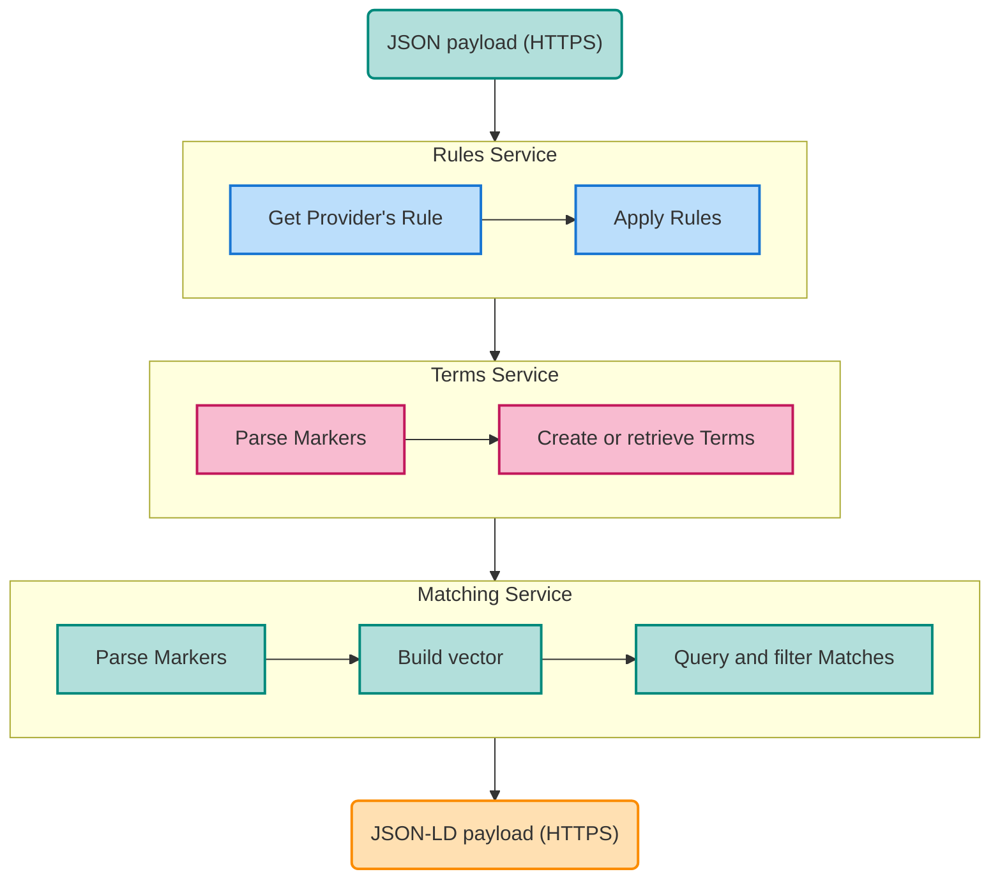

```mermaid
---
config:
  layout: dagre
---
flowchart TD
 subgraph S1["Rules Service"]
        n1@{ label: "Get Provider's Rule" }
        n2["Apply Rules"]
  end
 subgraph S2["Terms Service"]
        n21["Parse Markers"]
        n22["Create or retrieve Terms"]
  end
 subgraph S3["Matching Service"]
        n31["Parse Markers"]
        n32["Build vector"]
        n33["Query and filter Matches"]
  end
    A("JSON payload (HTTPS)") --> S1
    S1 --> S2
    S2 --> S3
    S3 --> B("JSON-LD payload (HTTPS)")
    n1 --> n2
    n21 --> n22
    n31 --> n32
    n32 --> n33
    n1@{ shape: rect}
     n1:::blue
     n2:::blue
     n21:::pink
     n22:::pink
     n31:::green
     n32:::green
     n33:::green
     A:::green
     B:::orange
    classDef green fill:#B2DFDB,stroke:#00897B,stroke-width:2px
    classDef orange fill:#FFE0B2,stroke:#FB8C00,stroke-width:2px
    classDef blue fill:#BBDEFB,stroke:#1976D2,stroke-width:2px
    classDef yellow fill:#FFF9C4,stroke:#FBC02D,stroke-width:2px
    classDef pink fill:#F8BBD0,stroke:#C2185B,stroke-width:2px
    classDef purple fill:#E1BEE7,stroke:#8E24AA,stroke-width:2px
```
